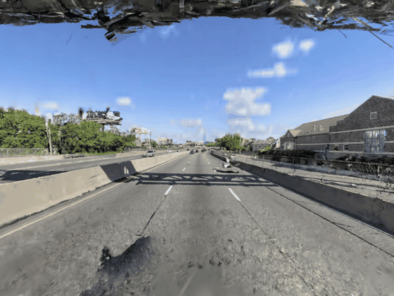
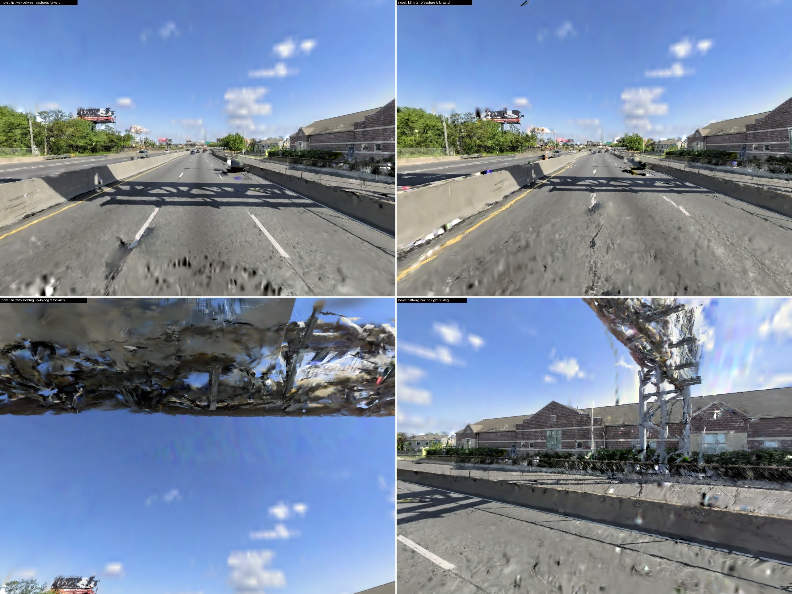
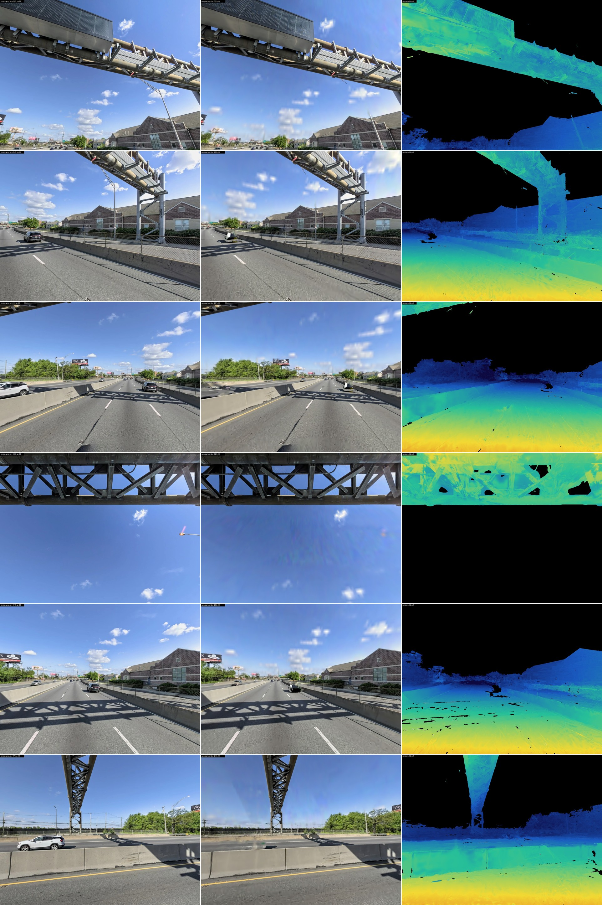

# msplat-street

Gaussian splat of a street from two Apple Look Around panoramas.

[View it in 3D](https://antimatter15.com/splat/?url=https://raw.githubusercontent.com/mblando9988/msplat-street/805f02cbc43dcc4847a8837eb8a6b6a4062e68bd/docs/street/street.splat#%5B0.4691%2C0.0371%2C0.8824%2C0.0%2C-0.1129%2C0.9934%2C0.0183%2C0.0%2C-0.8759%2C-0.1082%2C0.4702%2C0.0%2C0.07%2C0.03%2C6.55%2C1.0%5D) · [street.splat](docs/street/street.splat) (422,362 gaussians)

### New viewpoints

### Photo · render · depth

